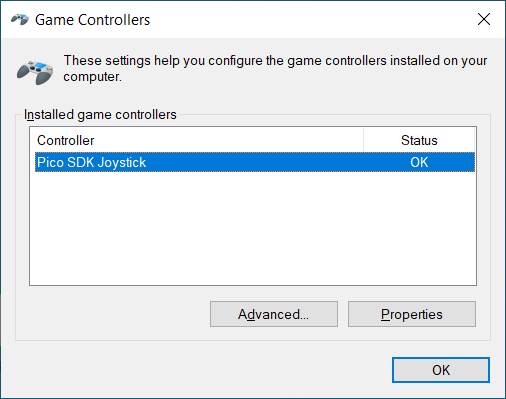
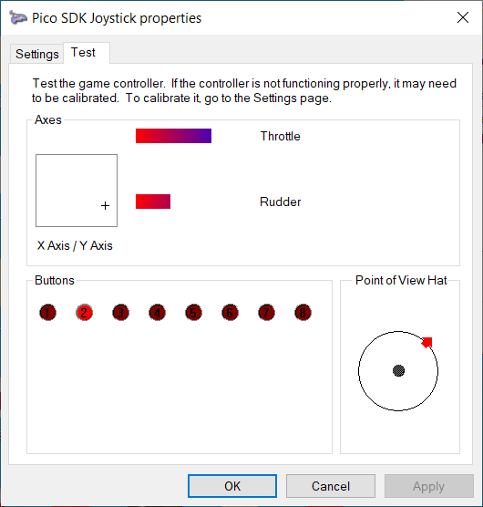
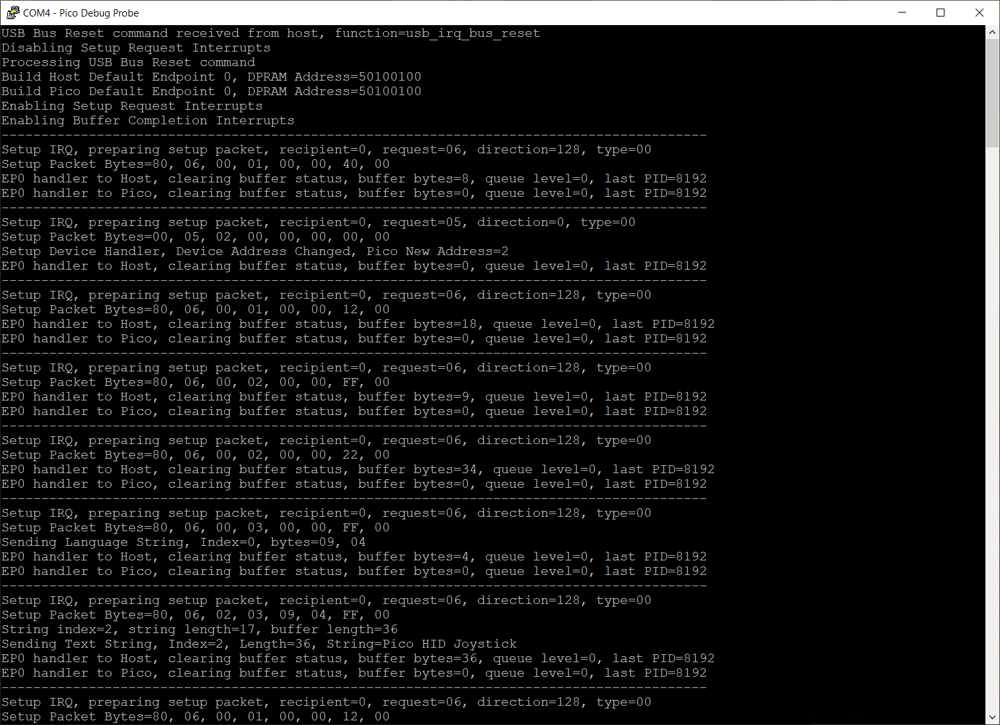

# Raspberry Pico SDK2 USB Joystick

### Raspberry Pico Native SDK-based Device USB stack.

Improved version of native USB Joystick, built against SDK version 2.

All interrupt-driven, continual background task not required.

Intended for anyone with a general interest in USB on a Raspberry Pico, or looking for a working example to adapt for other usage - e.g. MIDI.

A Serial/CDC version is in development.

### Usage

The example provided simulates a continually-running joystick.

Once compiled, the uf2 image can be uploaded as normal and the Pico attached to a host machine.

Debug Probe / Picoprobe or other UART interface device required to view debug messages.

Pico should then enumerate as a Human Interface Device / Joystick game controller and send continuous axis movement and button activity to the host.

Windows Game Controllers
  

#### Windows Game Controllers

   
On a Windows machine, type joy.cpl into the search box to display the game controller properties.

The properties windows should update continually at a nominal rate of 3Hz.

Pico pre-built .uf2 binary

Pre-Built .uf2 [available here](https://github.com/Serialcomms/Raspberry-Pico-SDK2-USB/releases/tag/Pico_HID_Joystick)

Pico Debug Output
  

#### Pico Debug Output

### Testing

Testing has been performed with a Windows 10 22H2 Host and a Pico Chip B2, ROM V3 device only.

Acknowledgements
  

* [Microsoft USB Device Enumeration](https://techcommunity.microsoft.com/t5/microsoft-usb-blog/how-does-usb-stack-enumerate-a-device/ba-p/270685)
* [Microsoft USB Control Transfer](https://learn.microsoft.com/en-us/windows-hardware/drivers/usbcon/usb-control-transfer)
* [USB Descriptor and Request Parser](https://eleccelerator.com/usbdescreqparser/)
* [Thesycon USB Descriptor Dumper](https://www.thesycon.de/eng/usb_descriptordumper.shtml)
* [Tana USB Sniffer](https://github.com/tana/pico_usb_sniffer)
* [Ataradov USB Sniffer](https://github.com/ataradov/usb-sniffer-lite)
* [phind.com](https://phind.com)

